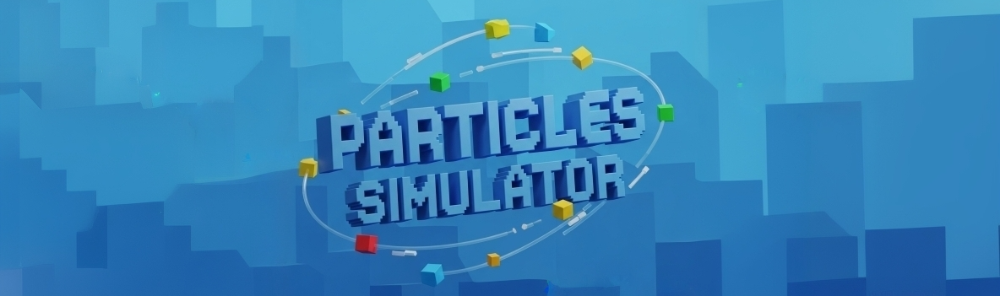

# Particles Physics Simulator

_
A programming hobby project
_

## Project introduction
`Particles Physics Simulator` is a project which takes a number of particles (point masses) and forces (gravitational attraction, drag, etc) and run a simulation for a given time and precision for finally plotting it as an animation.

The workings are based on numeric methods (not analytical). Each time-step the program calculates the forces for every particle and apply them during a non-infinitesimal step length. Assuming constant acceleration and velocity for the step duration as approximation. Then, it takes the new position and make the same calculations. 

An adaptability function has also been added so that the time steps adapt to the acceleration of each moment and particle, dividing the steps into smaller ones according to the user's configuration and the requirements of each simulation.

## Documentation
- Manual of how to use the program → [Usage](./docs/usage.md)
- Explanation of how the code is structured → [Code & Structure](./docs/code_and_structure.md)
  - How I designed the physics and logic of the simulation → [Simulation](./docs/simulation_physics.md)
- About the path the development has taken → [Changelog](./docs/changelog.md)
- About the future path to take and wanted features → [Roadmap](./docs/roadmap.md)

## What to expect
The program allows the user to create their custom particle space (simulation) by:
- Defining particles (mass, position, velocity, etc.)
- Using the created force functions or creating new ones
- Setting the simulation parameters (duration, time step length, adaptability, etc.)

And then plot an animation of the simulation also adjusted by the user (duration, refresh rate, orientation, etc.)

## Reason behind the project
This started as a learning python program. I wanted to implement physics simulates the dynamics of puntual particles in a space, with the ambition of implementing basic electrodynamics, using Newton and Coulomb equations for calculating forces and then basic cinematic equation for tracing the trajectories.

In the end, the project has taken more time than I had planned to spend on it. But in return I have ended up learning more about Python, Git and programming in general than I originally expected.

More about my goals with the project and opinion can be found in [More about](./docs/more_about.md)

